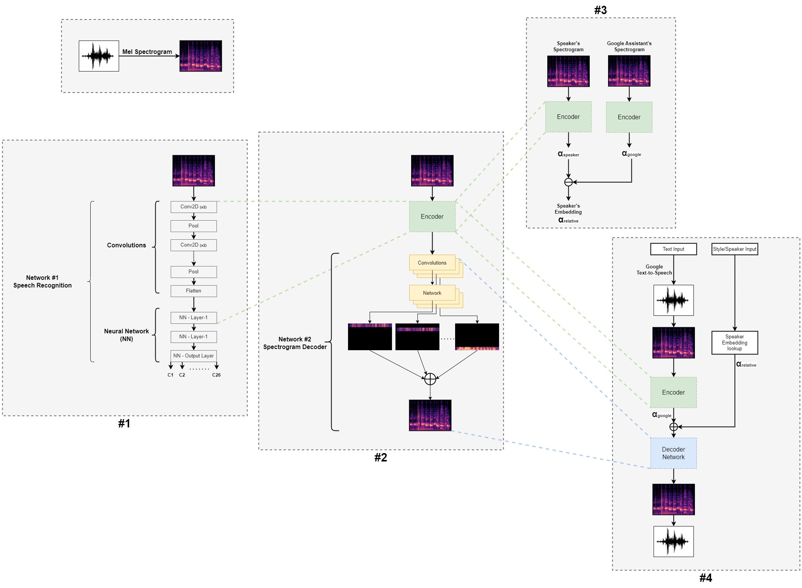
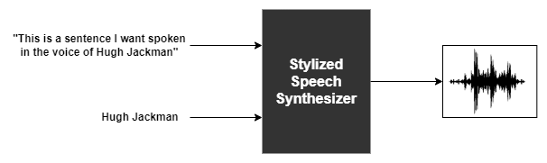
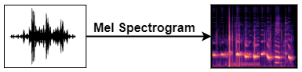
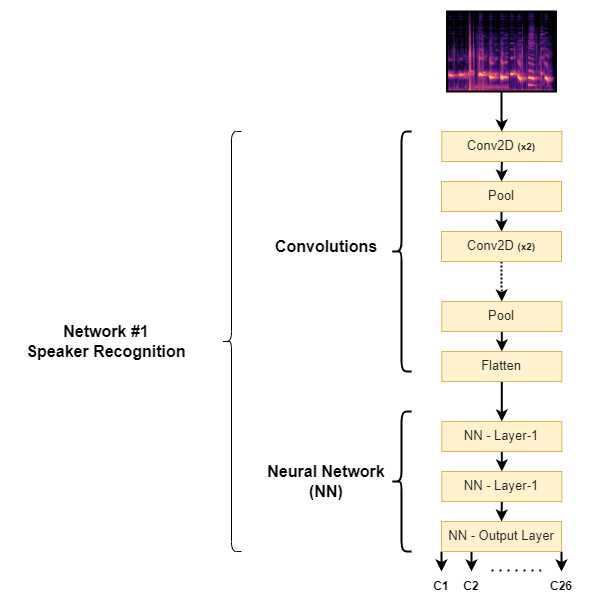

# Stylized Speech Synthesis
<i>Reproducing user specified text input in a user selected celebrity voice style</i>
 

## Data
For this project, we found a pre-existing voice dataset ‘VoxCeleb’, and filtered out 24 Indian Celebrities as our training set. To this dataset, we also added voice samples of our Professor and Google Assistant. Approximately 200 samples of about 5 seconds were considered for each unique speaker. The voice samples and training data can be checked out on the [VoxCeleb Website](https://www.robots.ox.ac.uk/~vgg/data/voxceleb/vox1.html).

* To learn more about the metadata of the audio files used for training, check out [0_Metadata.ipynb](code/0_Metadata.ipynb)

## Approach

In the procedure we have developed, we aim to utilize deep learning to generate stylized speech from the black box above. What is this black box and how do we build it? Let’s go step by step to understand.

## Step-1: Audio to Image

For our project’s purposes, instead of dealing with audio as a two-dimensional signal of amplitude over time, we first convert our audio samples into spectrograms which is a three-dimensional representation of the same signal giving us information about frequency over time with additional data about each frequency’s amplitude at any given point of time. Thus, a spectrogram can be seen as a two-dimensional image where the vertical space corresponds to frequencies, the horizontal space corresponds to time, and the pixel values at each cell of this image corresponds to the strength of that particular frequency of sound at that particular instance of time in the audio file. Therefore, the first step in our approach is to convert all the audio samples into spectrograms.

* To learn more about the preprocessing and preparation of the audio files for training, check out [1_Preprocessing.ipynb](code/1_Preprocessing.ipynb) and [2_Data_preparation.ipynb](code/2_Data_preparation.ipynb)

## Step-2: Training a Network to Identify the Speaker

The images obtained from step-1 are passed through a set of convolutions before feeding them into a neural network that establishes the speaker signature. This becomes the speaker recognition module that learns the voices of each celebrity in the training data. The voice of Google Assistant is also factored in here.

After trying several approaches, we narrowed in on [VGG-16 architecture](https://arxiv.org/abs/1409.1556) which is a type of CNN (Convolutional Neural Network) that is considered to be one of the best computer vision models to date. The convolutional layers are responsible for learning the spatial hierarchies of features in the input images, while the fully-connected layers are used for classification. One of the key features of the VGG-16 model is its use of very small convolutional filters that allow the model to learn a large number of features, which is important for capturing the fine-grained details in the images. The VGG-16 model also uses a large number of filters in each convolutional layer as opposed to using a deeper neural network, which helps to increase the representational power of the model.

* To learn more about the training the CNN, check out [3_Training.ipynb](code/3_Training.ipynb)