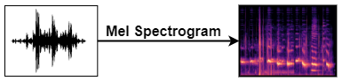
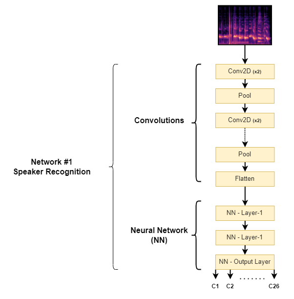

# Stylized Speech Synthesis
<i>Reproducing user specified text input in a user selected celebrity voice style</i>
 

## Data
For this project, we found a pre-existing voice dataset ‘VoxCeleb’, and filtered out 24 Indian Celebrities as our training set. To this dataset, we also added voice samples of our Professor and Google Assistant. Approximately 200 samples of about 5 seconds were considered for each unique speaker. The voice samples and training data can be checked out on the [VoxCeleb Website](https://www.robots.ox.ac.uk/~vgg/data/voxceleb/vox1.html).

* To learn more about the metadata of the audio files used for training, check out [0_Metadata.ipynb](code/0_Metadata.ipynb)

## Approach

In the procedure we have developed, we aim to utilize deep learning to generate stylized speech from the black box above. What is this black box and how do we build it? Let’s go step by step to understand.

### Step-1: Audio to Image

For our project’s purposes, instead of dealing with audio as a two-dimensional signal of amplitude over time, we first convert our audio samples into spectrograms which is a three-dimensional representation of the same signal giving us information about frequency over time with additional data about each frequency’s amplitude at any given point of time. Thus, a spectrogram can be seen as a two-dimensional image where the vertical space corresponds to frequencies, the horizontal space corresponds to time, and the pixel values at each cell of this image corresponds to the strength of that particular frequency of sound at that particular instance of time in the audio file. Therefore, the first step in our approach is to convert all the audio samples into spectrograms.

* To learn more about the preprocessing and preparation of the audio files for training, check out [1_Preprocessing.ipynb](code/1_Preprocessing.ipynb) and [2_Data_preparation.ipynb](code/2_Data_preparation.ipynb)

### Step-2: Training a Network to Identify the Speaker

The images obtained from step-1 are passed through a set of convolutions before feeding them into a neural network that establishes the speaker signature. This becomes the speaker recognition module that learns the voices of each celebrity in the training data. The voice of Google Assistant is also factored in here.

After trying several approaches, we narrowed in on [VGG-16 architecture](https://arxiv.org/abs/1409.1556) which is a type of CNN (Convolutional Neural Network) that is considered to be one of the best computer vision models to date. The convolutional layers are responsible for learning the spatial hierarchies of features in the input images, while the fully-connected layers are used for classification. One of the key features of the VGG-16 model is its use of very small convolutional filters that allow the model to learn a large number of features, which is important for capturing the fine-grained details in the images. The VGG-16 model also uses a large number of filters in each convolutional layer as opposed to using a deeper neural network, which helps to increase the representational power of the model.

* To learn more about the training the CNN, check out [3_Training.ipynb](code/3_Training.ipynb)

### Step-3: Building a Decoder for the Convolutions

Now our network is built to recognize the speaker. We now continue to our next task where we try to deconvolute the convolutions from the previous step. This is done to reconstruct an estimate of the original spectrogram and will later be useful when creating a spectrogram for the stylized speech.

From the previous stage, we have a 4096-dimensional convolution output as the input to the decoder, and we want to recreate spectrogram images of size 128 x 171 (21,888 pixels) as the output. First, we experimented with a single model to achieve this but we constantly ran out of computational requirements given the type of data we are dealing with. Therefore, we divided the task by forcing multiple neural networks to recreate only part of the image. The below figure illustrates this method more clearly

Finally, we utilized 18 models with 15 epochs and 18 layers of convolutions very similar to the previous stage.

* To learn more about the building the decoder using the previously trained CNN, check out [4_Decoder_Training.ipynb](code/4_Decoder_Training.ipynb)

### Step-4: Speaker Embedding (Capturing Voice Signatures)

We use the convolutions from the first network (Step-2) to obtain a 4096-dimensional vector representation of each speaker relative to Google in this stage. Our expectation is that when the Google Assistant speaks the same phrases as the celebrity, the only difference between the two files will be the voice (or style) of the speaker with respect to Google Assistant. So we expect to capture this difference as a 4096-dimensional representation for each speaker.

To achieve this task, we simply take a sample audio for each speaker, pass it through the encoder (convolutions) from step-2, and get a 4096-dimensional representation. Next, we transcribe the same audio, give the text to google assistant for speaking, capture its audio, and pass it through the same convolutions to get its 4096-dimensional representation.

> Here, instead of giving google the exact transcriptions of the speaker, we also tried to include misspellings, various punctuations, informal words, and pause words to try and make the speech as similar to the celebrity as possible.

* To learn more about the working and code for Speaker Embedding, check out [5_Voice_Embeddings.ipynb](code/5_Voice_Embeddings.ipynb)

### Step-5: Reconstruction

The final stage calls for putting all the pieces together.

* From the text input of the user, we first generate a google assistant voice sample.
* The voice sample is then converted to a spectrogram
* This spectrogram is passed through the convolutions of the speaker recognition network (from step-2) to get a 4096-dimensional vector representation of Google Assistant’s speech.
* Based on the user’s choice of voice style, we add the relative speaker embedding from step-3 and feed this modified encoded vector to the decoder
* The decoder then recreates a spectrogram from the 4096-dimensional input
* This estimated spectrogram is then converted back to audio

* To learn more about our final reconstruction by putting everything together and trying to generate an audio out of a sample text, check out [6_Reconstruction.ipynb](code/6_Reconstruction.ipynb)

## Roadblocks & Future Scope

It is certainly a rare event to see machine learning projects without any roadblocks or tradeoffs of some kind. From what we have discussed so far, we have multiple complex procedures in our project which might lead to the addition of noise to our final output. Let us break down task-by-task, and what might add noise to the system.

### 1. Speaker Recognition
We built a speech recognition system that can discriminate between voices with an accuracy of 59.96%. This might be a tremendous result considering a baseline of 5%, but when using the same network for generative purposes, the same 60% might be a very weak statistic. When a neural network classifier is trained to differentiate between cats and dogs, as far as the network is concerned, the whole universe of inputs corresponds to either a cat or a dog. An image of a monkey, whale, or laptop all corresponds to either a dog or a cat with some confidence.

One possible solution to this problem is to include as many voices as possible to expand the “learning horizon” and also by adding noise samples (musical instruments, ambient noise, environmental sounds, etc.) that do not correspond to any voice styles and get the network to truly capture the identifying factors of the voices.

### 2. Encoder-Decoder Network
When building a decoder network, we are not in control of the architecture of the encoder network as it is a learned entity from speaker recognition training. Therefore, backtracking convolutions that were designed for discrimination for the purpose of reconstruction might be a cumbersome task. Additionally, since we used 18 networks to achieve this task, tracking the losses of 18 networks and keeping all of their performances high is difficult, and this is evident from our experiments as the MSEs ranged from a few 1000ths to a few 1000s.

A possible workaround would be to first build an encoder-decoder network that does a decent job at the reconstruction of the signal and then use the encoded output in a neural network to train speaker recognition. Another thing to keep in mind here is that this might again lead to a bad discriminator (classifier). Hence, an alternate approach where we build an encoder-decoder pair and also a speaker recognition network keeping track of both networks’ performances would be a better (but more complex) solution.

### 3. Speaker Embedding
Although we tried our best to recreate the intonations and pauses of the speakers when generating speech through Google Assistant for embedding, it was not perfect. For instance, we got a difference of 5 units between the two versions of Google Assistant’s speeches (one in the training data, and one used for embedding). So embedding doesn’t exactly represent only the “voice signatures”, but also includes intonation differences and other similar semantic factors.

### 4. Reconstruction
When converting the audio from a 2D waveform to a 3D spectrogram, we have a lossy conversion due to the trade-off discussed in step-1. Therefore, a conversion like `Audio → Spectrogram → Audio` itself adds noise to the system even without any modification.

Throughout the project, we have used the default STFT window and sliding lengths available for all audio-spectrogram conversions. Instead, we can possibly finetune these parameters to fit speech conversions with minimal loss.

> All these roadblocks have collectively impacted our final outcome resulting in an audio completely filled with noise. We are currently working on addressing each roadblock mentioned above and improve the performance of our generative model.

## Links
1. [Medium article](https://medium.com/@sunilkamkar97/stylized-speech-synthesis-3ba44d238922) about the same
2. Profiles of Contributors - [Chyavan](https://chyavan-mc.github.io), [Ruchi](https://github.com/honeybadger21), [Sunil](https://sunilks12.github.io/)